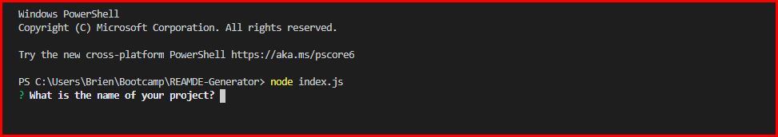
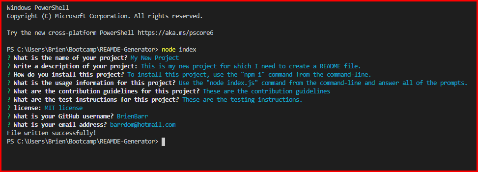
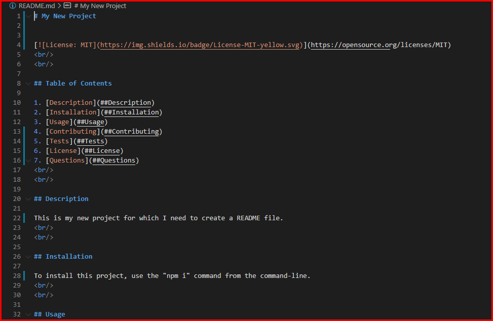
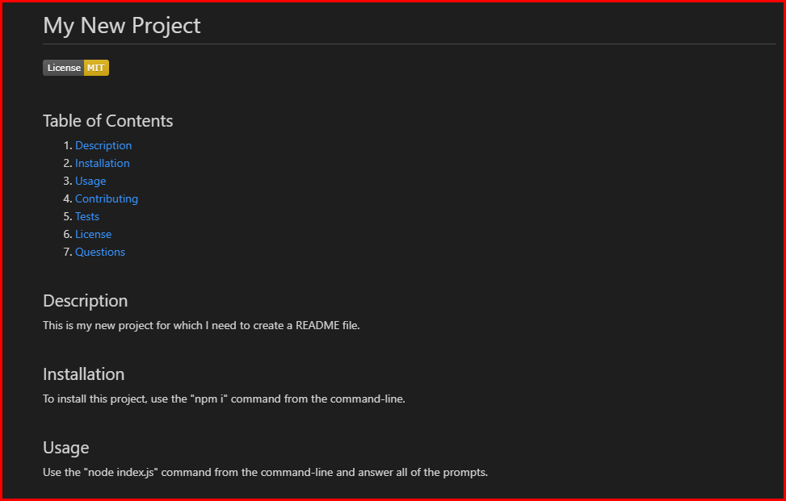

# README-Generator
 
 

## Table of Contents

1. [Description](##Description)
2. [Installation](##Installation)
3. [Usage](##Usage)
4. [Screencaps](##Screencaps)
5. [Walk thru Video](##Walk%20thru%20Video)
6. [Questions](##Questions)
 
 

## Description

This README-Generator is a Node.js app that will create a README file for the app in the root directory of the app.  The README file is generated via user input from the command-line.  In fact, the core of this README file was generated with the app.
 
 

## Installation

To install this app, from the root of the app's directory in Terminal, run the "npm i" command to install the dependencies. Then, use the command "node index.js" to run the app. 
 
 

## Usage

After running the "node index.js" command to run the app, answer the user prompts to fill in the content of the README file. After all of the prompts are answered, you will see the message "File written successfully!". Now, you can modify the file as you need.
 
 

## Screencaps

 
Starting the app from the command-line 

 
Return message after answering all command-line prompts 

 
Generated markdown file 

 
Rendered markdown file 

 
 

## Walk thru Video

 
 

## Questions

[GitHub/BrienBarr](https://github.com/BrienBarr) 
For additional questions, e-mail me at: [barrdom@hotmail.com](mailto:barrdom@hotmail.com)
